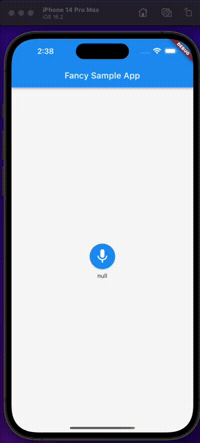

# fancy_audio_player

Simple audio recorder ready to use (Like instant soup).

## Demo



## Getting started

TODO: List prerequisites and provide or point to information on how to
start using the package.

## Usage
to `/example` folder.

```dart
 AudioRecorderButton(
    maxRecordDuration: const Duration(seconds: 80),
    onRecordComplete: (value) {
        log('$value');
    },
 ),
```

